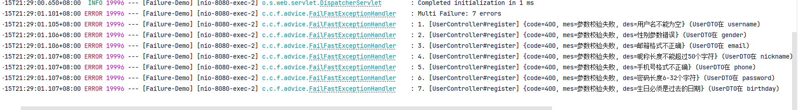
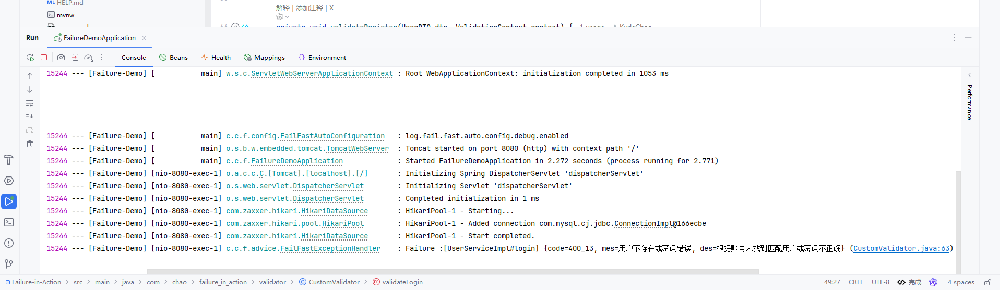

# Failure in Action

[](https://central.sonatype.com/artifact/io.github.kyriechao/failure-spring-boot-starter)
[](LICENSE)
[](https://spring.io/projects/spring-boot)

> **Fail Fast, Fail Safe.**
>
> A best practice demonstration project based on **Spring Boot 3 + Failure Framework**. This project shows how to separate complex business validation logic from Controller/Service through "declarative validation" and "functional programming" ideas, building a robust system with high cohesion and low coupling.

[中文版本 (Chinese Version)](README.md)

## 📚 Pain Points vs Solutions

| Traditional Pain Points | Failure Solution |
| :--- | :--- |
| **Code Bloat**: Lots of `if (obj == null) throw ...` | **Fluent API**: `Failure.with(ctx).notNull(obj).verify()` |
| **Logic Coupling**: Validation logic scattered in business code | **Strategy Separation**: Independent `FastValidator` or `TypedValidator` |
| **Feedback Delay**: Errors reported only at database insertion | **Fail-Fast**: Parameter errors returned immediately, blocking expensive database operations |
| **Maintenance Difficulty**: Error codes scattered, inconsistent frontend prompts | **Unified Management**: Strongly typed `ResponseCode` enum with automatic I18n |

## 🛠️ Tech Stack

*   **Core Framework**: Spring Boot 3.2.0 (Java 17)
*   **Validation Framework**: `failure-spring-boot-starter` 1.0.2 (core dependency)
*   **ORM**: MyBatis Plus 3.5.5
*   **Database**: MySQL 8.0
*   **Tools**: Lombok, Hutool

## ✨ Core Code Demonstration

### 📐 Layered Validation Strategy

We recommend using different validation strategies at different layers for optimal performance and code organization:

| Layer | Validation Method | Annotation Combination |
| :--- | :--- | :--- |
| **Controller** | JSR-303 field validation (support grouping) | `@Validate(fast = false)` + `@Validated(Group.class)` |
| **Service** | Business logic validation (database duplicate check, etc.) | `@Validate(value = CustomValidator.class, fast = false)` |

### 1. Controller Layer: JSR-303 Field Validation
Use native annotations (such as `@NotBlank`) with Group grouping to handle format validation. Use `@Validate(fast = false)` to ensure all format errors are returned at once.

**DTO Definition:**
```java
@Data
public class UserDTO {
    @NotBlank(groups = Create.class, message = "Username cannot be empty")
    private String username;

    @NotBlank(groups = Create.class, message = "Password cannot be empty")
    @Length(min = 6, groups = Create.class, message = "Password length cannot be less than 6")
    private String password;

    // Define grouping interfaces
    public interface Create {}
    public interface Update {}
}
```

**Controller Implementation:**
```java
@RestController
@RequestMapping("/users")
public class UserController {

    @Autowired
    private UserService userService;

    @PostMapping("/register")
    // fast=false: Collect all JSR-303 errors (e.g., username empty and password too short)
    @Validate(fast = false)
    public Result<Void> register(@RequestBody @Validated(UserDTO.Create.class) UserDTO dto) {
        userService.register(dto);
        return Result.success();
    }
}
```

### 2. Service Layer: Business Logic Validation
Use `CustomValidator` to handle complex business rules (such as database duplicate check, status check).

**Service Implementation:**
```java
@Service
public class UserService {

    @Autowired
    private UserMapper userMapper;

    // Specify validator, fast=false: Collect all business errors
    @Validate(value = UserRegisterValidator.class, fast = false)
    public void register(UserDTO dto) {
        // Execute business logic after validation passes
        User user = new User();
        BeanUtils.copyProperties(dto, user);
        userMapper.insert(user);
    }
}
```

**Validator Implementation:**
```java
@Component
@RequiredArgsConstructor
public class UserRegisterValidator implements FastValidator<UserDTO> {

    private final UserMapper userMapper;

    @Override
    public void validate(UserDTO dto, ValidationContext context) {
        // Chain call: Check if username, email, phone number already exist
        Failure.with(context)
                .isFalse(exists(User::getUsername, dto.getUsername()), UserCode.USERNAME_EXIST)
                .isFalse(exists(User::getEmail, dto.getEmail()), UserCode.EMAIL_EXIST)
                .verify();
    }

    private boolean exists(SFunction<User, ?> field, String value) {
        return userMapper.exists(new LambdaQueryWrapper<User>().eq(field, value));
    }
}
```


| Validation Method | Call Example                              | Error Location        | Jump |
| ---- |-----------------------------------| ----------------------- | -- |
| Annotation   | `@NotNull(groups = Create.class)` | `(UserDTO at username)`   | ❌  |
| Programmatic  | `Failure...notBlank(...)...`      | `(CustomValidator.java:46)` | ✅  |

### Annotation-driven Error (Field-level Location)
```text
2026-03-15T21:29:01.106+08:00 ERROR ... : 2. [UserController#register] {code=400, mes=Parameter validation failed, des=Gender parameter error} (UserDTO at gender)
```
> Locate to specific field, suitable for `@NotNull` and other annotation scenarios


### Programmatic Error (Code line-level Jump)
```text
2026-03-15T21:32:40.552+08:00 ERROR ... : Failure :[UserServiceImpl#login] {code=400_12, mes=Password cannot be empty, des=Password field is required} (CustomValidator.java:46)
```


> `CustomValidator.java:46` is clickable in IDE, suitable for `Failure...` chain calls

> In the figure, `(CustomValidator.java:46)` is light blue, indicating IDE can click to jump to source code


**Quick Distinction**:
- See `at xxx)` → Annotation validation, check annotations on fields
- See `.java:number)` → Programmatic validation, click to jump and modify code
---
## 🚀 Quick Start

### Step 1: Add Dependency
Add Starter in `pom.xml`:

```xml
<dependency>
    <groupId>io.github.kyriechao</groupId>
    <artifactId>failure-spring-boot-starter</artifactId>
    <version>1.1.1</version> <!-- Please use the latest version -->
</dependency>
```

### Step 2: Define Error Codes
Implement `ResponseCode` interface to uniformly manage error messages:

```java
@Getter
@AllArgsConstructor
public enum UserCode implements ResponseCode {
    USERNAME_BLANK(1001, "Username cannot be empty"),
    PASSWORD_BLANK(1002, "Password cannot be empty"),
    USER_NOT_FOUND(1003, "User not found"),
    // ...
    ;

    private final int code;
    private final String message;
}
```


## 📂 Project Structure

```text
src/main/java/com/chao/failure_in_action
├── config             // Global configuration
├── controller         // Control layer (integrated @Validate)
├── exception          // Global exception handling (GlobalExceptionHandler)
├── model
│   ├── dto            // Data transfer objects
│   ├── entity         // Database entities
│   └── enums          // Error codes (UserCode)
├── repository         // Database access layer
├── service            // Business logic layer
└── validator          // Validation layer
    ├── GlobalValidator.java      // Centralized validation
    └── UserRegisterValidator.java // Independent validator
```

## 🔗 Related Resources

*   **Framework Source Code**: [Failure Framework](https://github.com/KyrieChao/Failure)
*   **Author's Blog**: [Kyrie's Blog](https://kyriechao.github.io)

---
*Developed with ❤️ by Kyrie Chao*